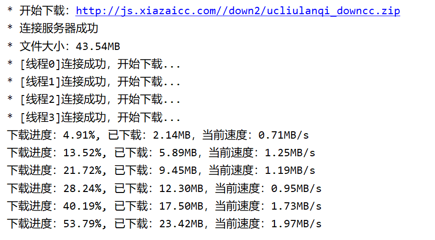
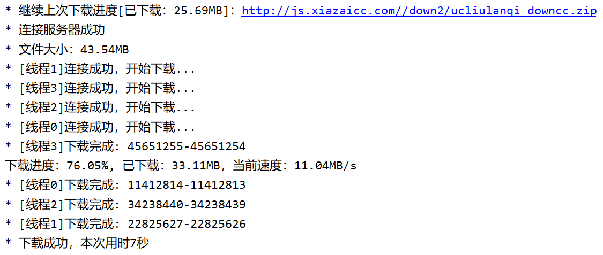

# Downloader

Java实现的一个简单的多线程下载器，支持断点续传。这两项功能已经完成，并能正确执行，但还有一点需要完善的地方。

多线程下载及断点续传的实现是使用 HTTP/1.1 引入的 Range 请求参数

- Downloader: 主类，负责分配任务给各个子线程，及检测进度
- DownloadFile: 表示要下载的哪个文件，为了能写输入到文件的指定位置，使用 RandomAccessFile 类操作文件
- DownloadTask: 实际执行下载的线程，获取 [lowerBound, upperBound] 区间的数据，当下载过程中出现异常时要通知其他线程，结束下载
- Logger: 实时记录下载进度

#### 演示：

下载一个文件：

强制结束程序，然后再运行一次：